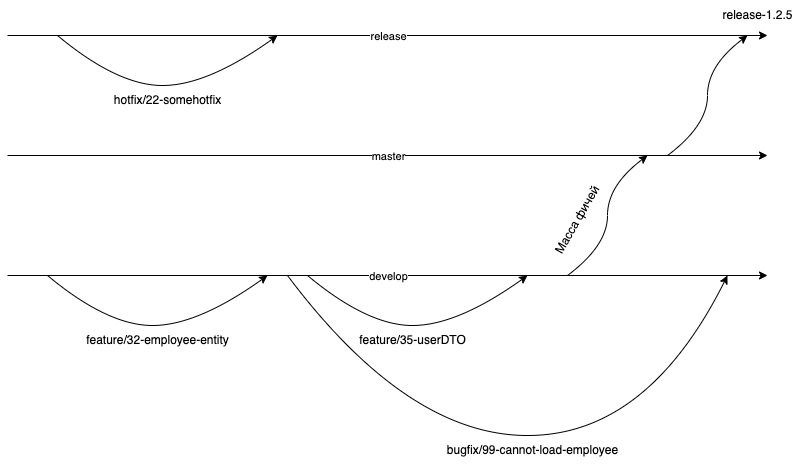

# wiki

1. Общая информация
2. Ветки
2.1. Постоянные ветки: master и develop
2.2. Функциональные ветки задач: feature/<issue-id>-description
2.3. Ветки релизов: release/<release-tag>
2.4. Ветки хотфиксов: hotfix/<optional  issue-id>-<description>
2.5. Ветки багфиксов: bugfix/<optional issue id>-<description>

1. Общая информация

В рамках работы с Git существует несколько популярных стратегий. Фокус данной статьи направлен на описание применения стратегии GitFlow

Схема работы приведена ниже

2. Ветки
2.1. Постоянные ветки: master develop и release

Традиционно существует 3 постоянные ветки:

production-ветка: master
development-ветка: develop
release-ветка: release

Всем коммитам в master-ветке присваивают версию с помощью git tags. 

2.2. Функциональные ветки задач: feature/<issue-id>-description

Традиционно при подходе GitFlow используются ветки с префиксом feature/. Префикс добавляется при выборе типа ветки.

Данные ветки создаются к существующим задачам разработки, отделяются от ветки develop и связываются с issue из борды. 
После завершения работ над задачей ветка задачи сливается в develop ветку и удаляется.
После завершения пула задач и подготовки "кандидата" в релиз ветка develop отделяется в ветку release/<release-tag> (см пункт 2.3).

Для корректного связывания ветки и соответствующего pull request рекомендуется придерживаться следующих конвенций:

Названия веток создавать в формате feature/32-employee-add. Такой формат позволяет привязать задачу (например, 32-добавление работника) и приводит краткое описание фичи или issue.
Названия pull request создавать в формате 32 My New Feature. С помощью такого формата можно сразу определить issue и назначение Pull Request.

2.3. Ветки релизов: release/<release-tag>
Ветки с префиксом release создаются от ветки develop по мере необходимости (возможности) выпуска стабильного релиза продукта.
Отдельные релизные ветки позволяют разделять работу команды - коллеги могут продолжать работу над задачами, не входящими в предстоящий релиз, а также оценивать скорость релизов, более детально отлавливать баги и т.д.
После отделения релизной ветки от ветки разработки (develop) дополнения в ветку не допускаются (за исключением исправления багов и подготовки документации - см. пункт 2.5).
Когда подготовка к релизу завершена (например, все тесты и Jenkins Jobs успешно завершились), релизные ветки сливаются с master веткой. Коммит, создаваемый при слиянии, сопровождается тегом релиза. 
release/ ветки как правило удаляются после слияния с master (не обязательно).
Важно сливать ветку релиза также с веткой develop (чтобы не упустить критические изменения).

Версии традиционно задаются с учётом следующих конвенций семантического версионирования:

 Пример: версия 1.2.3
1 - мажорная версия, меняется редко и в результате больших изменений API (мажорный релиз). Обратная совместимость отсутствует.
2 - минорная версия, её изменения чаще происходят в результате нового запланированного релиза. Изменения минорной версии как правило обратно совместимы.
3 - патч версия, часто означает фикс багов или незначительные дополнения функционала, совместимые с минорной версией и не меняющие поведение продукта для клиента.
Разработка часто начинается с версии 0.1.0.
Допускается дополнение версии метаданными, например: 0.1.1-demo

Релизные ветки и теги следует создавать с учётом конвенций семантического версионирования, например: ветка release/0.1 и тег 0.1.0 (для веток как правило опускаются патч-версии).

2.4. Ветки хотфиксов: hotfix/<optional  issue-id>-<description>

Данные ветки не являются обязательными. Это единственный тип веток (кроме develop), непосредственно отделяющихся и сливающихся в master.

В случае нахождения багов, от ветки master отделяется ветка хотфикса с префиксом /hotfix. Данная ветка может иметь или не иметь issue id (ID из борды в гите), но обязана иметь краткое описание фикса.
При исправлении бага данная ветка сливается в master, изменяя только патч версию.

Изменения также необходимо слить с веткой develop.

Данные ветки удаляются после сливания с develop и master.
2.5. Ветки багфиксов: bugfix/<issue id>-<description>

Данные ветки не являются обязательными и создаются при нахождении багов.

При исправлении бага данная ветка сливается обратно в develop/master ветку.

После сливания ветки багфиксов также удаляются.
